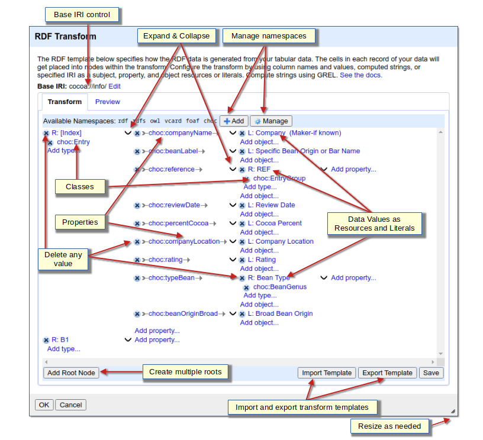

<!--
 *  README Markdown
 *
 *  The RDF Transform Project ReadMe Markdown.
 *
 *  Copyright 2025 Keven L. Ates
 *
 *  Licensed under the Apache License, Version 2.0 (the "License");
 *  you may not use this file except in compliance with the License.
 *  You may obtain a copy of the License at
 *
 *      http://www.apache.org/licenses/LICENSE-2.0
 *
 *  Unless required by applicable law or agreed to in writing, software
 *  distributed under the License is distributed on an "AS IS" BASIS,
 *  WITHOUT WARRANTIES OR CONDITIONS OF ANY KIND, either express or implied.
 *  See the License for the specific language governing permissions and
 *  limitations under the License.
 *
-->

# RDF Transform

  
  

Build Note
On failed builds, Maven repositories may need to be reset. Review Actions tab for issues. If needed, run the "Maven Reset Dependencies" workflow.

## Introduction
This project uses a graphical user interface (GUI) for transforming OpenRefine project data to RDF-based formats. The transform maps the data with a template graph designed using the GUI.

RDF Transform is based on the venerable "RDF Extension" ([grefine-rdf-extension](https://github.com/stkenny/grefine-rdf-extension)). However, it has been thoroughly rewritten to incorporate the newer Java and JavaScript technologies, techniques, and processing enhancements.

**The latest RDF Transform 2.3+ releases only work with the OpenRefine 3.9+ series.** 
RDF Transform uses processes and libraries provided by OpenRefine. Therefore, RDF Transform releases are updated to match OpenRefine releases. Later RDF Transform releases mixed with earlier OpenRefine releases are problematic due to various changes such as:
* Updated Jena library (a primary requirement)
* Updated language function registration
* Expanded CSRF protections

## Documentation
See the [wiki](https://github.com/AtesComp/rdf-transform/wiki) for more information.

Once installed, the RDF Transform extension contains an internal website containing related documentation and a tutorial. Use its "See the docs." link in the RDF Transform dialog.

## Download
See the [Install page Prerequisites on the wiki](https://github.com/AtesComp/rdf-transform/wiki/Install#prerequisites) for important Java version information.

<!-- RDF Transform Version Control -->
### Releases
Download the current [RDF Transform v2.3.6](https://github.com/AtesComp/rdf-transform/releases/download/v2.3.6/rdf-transform-2.3.6.zip) release.

See the current [v2.3.6](https://github.com/AtesComp/rdf-transform/releases/tag/v2.3.6) release information.

See the [Releases section on the wiki Home page](https://github.com/AtesComp/rdf-transform/wiki#releases) for more information.

## Install
See the [Install page on the wiki](https://github.com/AtesComp/rdf-transform/wiki/Install) for more information.

## Build
See the wiki [Build](https://github.com/AtesComp/rdf-transform/wiki/Build) page.

In particular, see the wiki [VSCode IDE](https://github.com/AtesComp/rdf-transform/wiki/Build#vscode) subsection.

## Issues
***General interaction issue with OpenRefine versions, Web Browsers, OSes, etc., not specifically code related.***

**NOTE**: It is recommended that you have an active Internet connection when using the extension as it can download ontologies from specified namespaces (such as rdf, rdfs, owl and foaf). You can (re)add namespaces and specify whether to download the ontology (or not) from the namespace declaration URL. If you must run OpenRefine from an offline location, you can copy the ontologies to files in your offline space and use the "from file" feature to load the ontologies.

### OpenRefine
As an extension, RDF Transform runs under the control of OpenRefine and its JVM. As such, the libraries included with OpenRefine override any of the same libraries included with the extension. This limits the extension to OpenRefine's version of those library functions and features.

OpenRefine packages a Java JRE for Windows and Mac OSes. Linux users use their package managers to install Java versions.

The latest RDF Transform releases (2.2.2 and above) only work with OpenRefine 3.6 or better due to upgraded Apache Jena library features that are not backward compatible.

See the [wiki](https://github.com/AtesComp/rdf-transform/wiki) for more information.

### OSes
See the [Install page on the wiki](https://github.com/AtesComp/rdf-transform/wiki/Install) for related information.

#### Linux
RDF Transform has been tested against OpenRefine 3.5.2 and above on a modern Debian-based OS (Ubuntu derivative) using Chrome. In general, use the latest OpenRefine release with the latest RDF Transform extension release.

RDF Transform requires Java 11 to 21. Use the Linux distributions preferred package manager to ensure--at a minimum--that a Java 11 JRE version is installed.
* Check your java version with `java -version`
* Use a java version manager, such as `update-java-alternatives` to ensure a working default Java version is used.

See [Java, JDKs, and JREs](#java-jdks-and-jres) below.

#### Windows
Test runs on MS Windows 10 have indicated the JVM opertate slightly different than on Linux. The MS Windows version tends to be more sensitive to certain statements.
1. The version of Simile Butterfly that processes the limited server-side JavaScript engine can fail on unused declarative statements such as "importPackage()". If the package is not found, Windows systems may silently fail to run any following statements whereas Linux systems will continue. To mitigate against server-side JavaScript issues, all possible server-side JavaScript code has been migrated to Java.
2. The JVM relies on OS specific services to process network connections. It may process web-based content negotiation differently on a particular OS. On Windows, if the URL does not produce the expected response, negotiation and the related response processing may lock the process for an unreasonably long time whereas Linux may fail safe and quickly. To mitigate against web content negotiation issues, a Faulty Content Negotiation processor is used identify known fault intolerant processing.  As faults become known, they are added to the processor.

The Windows versions of OpenRefine are bundled with a Java 11 JRE. Since RDF Transform requires Java 11 to 21, no upgrade is required.

See [Java, JDKs, and JREs](#java-jdks-and-jres) below.

#### Mac
The MacOS versions of OpenRefine are bundled with a Java 11 JRE. Since RDF Transform requires Java 11 to 21, no upgrade is required.

See [Java, JDKs, and JREs](#java-jdks-and-jres) below.

#### Java, JDKs, and JREs
Java versions up to Java 21 JDK / JRE can be used.

* NOTE: So called "official" Java installs later than 8 do not have a separate JRE install. Therefore, in general, install the JDK. Your OS's packaging system may have a separate, general JRE install. For "JRE only" installs, a custom JRE can be created with the `jlink` command. See the wiki Install section [Java JDKs, JREs, and JVMs! Oh, My!](https://github.com/AtesComp/rdf-transform/wiki/Install#java-jdks-jres-and-jvms-oh-my) for more.

Set the `JAVA_HOME` env variable to the preferred Java directory in the `refine.ini` file if not using the OS's default Java version or the OpenRefine packaged Java version.

### Reporting
Please report any problem using RDF Transform to the code repository's [Issues](https://github.com/AtesComp/rdf-transform/issues).
